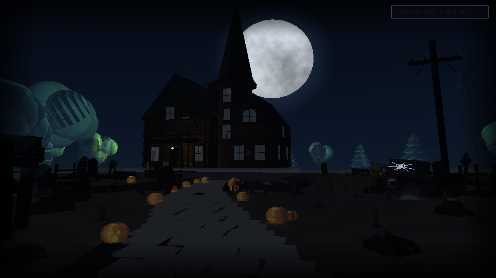
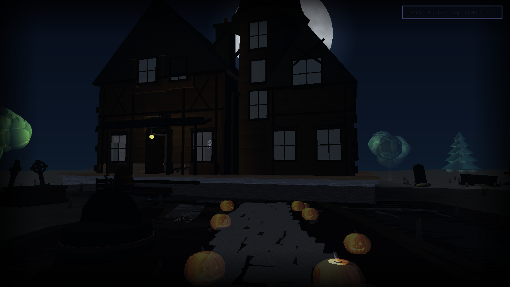
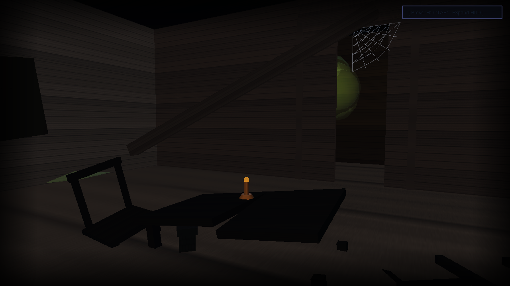
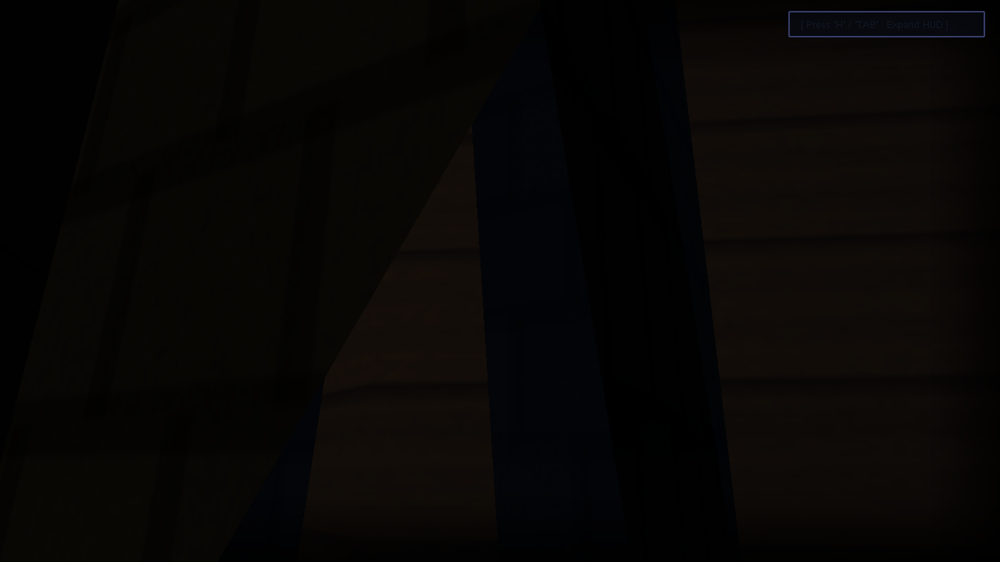
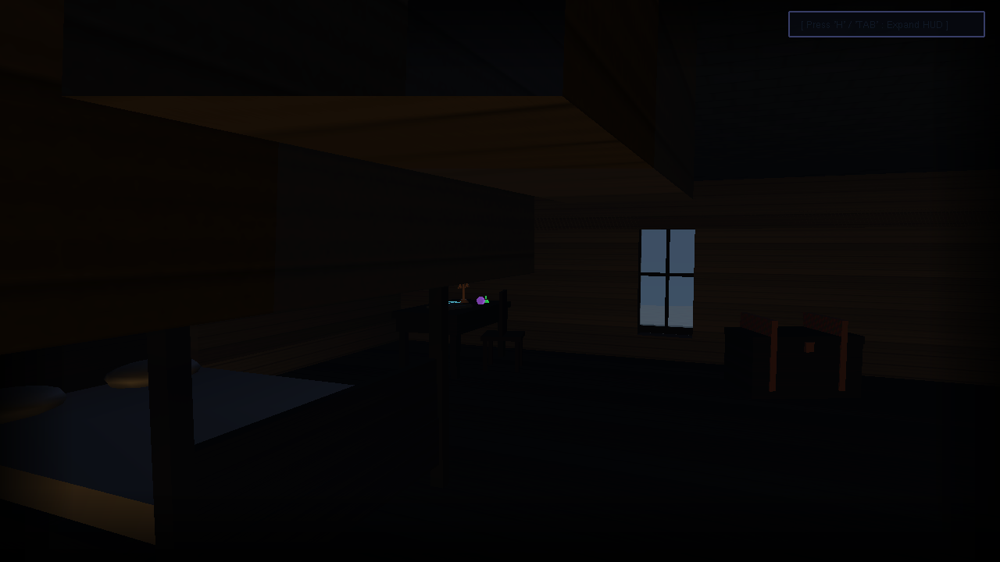
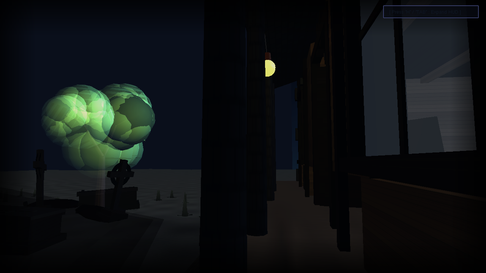
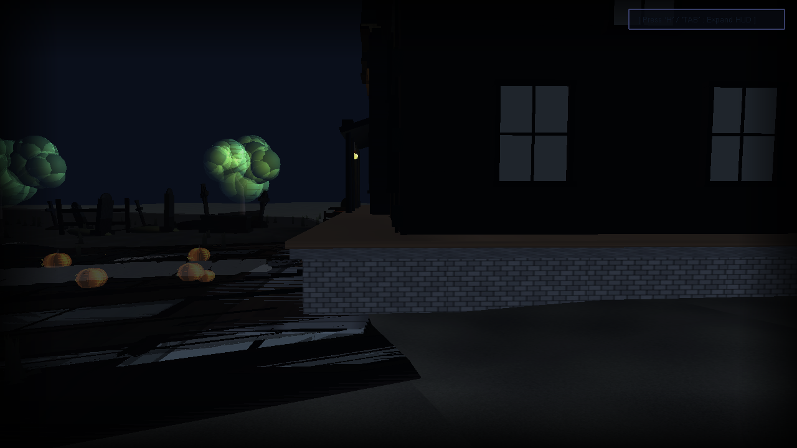
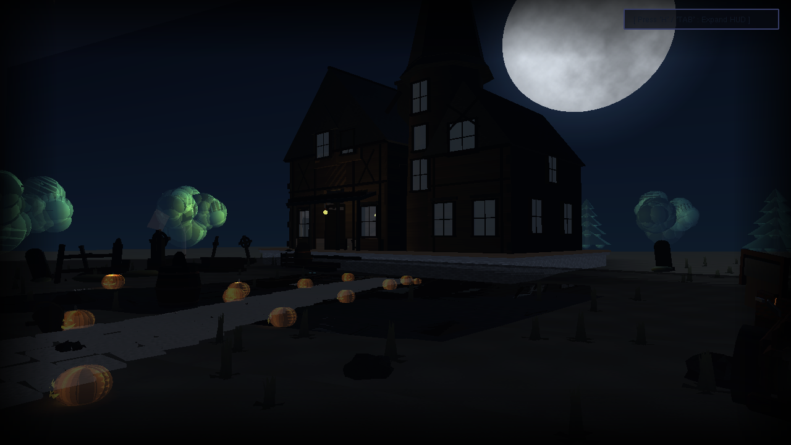
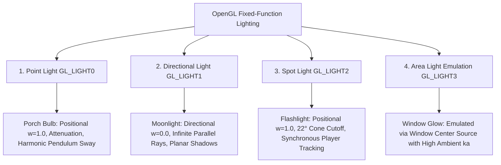

# Horror House at Night — 3D Computer Graphics Project

**Developer:** MD Jahid Hasan Jim  
**Roll Number:** 2107054  
**Course:** Computer Graphics Sessional (CSE 4-1)  
**Framework:** C++ / Legacy OpenGL (Fixed-Function Pipeline) with FreeGLUT & Windows Multimedia (WinMM)  

---

## 🎬 Project Overview

**"Horror House at Night"** is a real-time, highly detailed 3D gothic horror simulation built from scratch in C++ and OpenGL. The project demonstrates all **FOUR core computer graphics light models** operating concurrently with **Texture Mapping (`GL_MODULATE`)**, realistic procedural animations, mathematical heightmap terrain, multi-floor interior architecture, and interactive first-person exploration.



---

## 📸 Visual Showcase & Architectural Gallery

| Scene / Feature | Preview | Description |
|---|---|---|
| **Moonlit Exterior Facade** |  | High-pitched slate gabled roofs, stone foundation plinth, twin chimneys, dormers, and full moon illumination. |
| **Front Porch & Wide-Open Doorway** |  | Weathered wooden porch steps, swinging incandescent bulb, and front door swung wide open for free walk-in access. |
| **1st Floor Dilapidated Parlor** |  | Broken floorboards, red-brick fireplace, antique grandfather clock with oscillating brass pendulum, and fallen timbers. |
| **Completed 15-Step Staircase** |  | Full 15-step wooden staircase with risers, bullnose treads, baluster spindles, and handrails connecting 1st floor to 2nd floor. |
| **2nd Floor (Dotola) Master Bedroom** |  | Gothic 4-poster mahogany bed with velvet quilt, alchemist study desk, open arcane grimoire, and 3-arm candelabra. |
| **View Outside Through Transparent Windows** |  | Translucent glass and real architectural wall cutouts allow looking outside to the moonlit yard from indoors. |
| **Foggy Cemetery & Jack-o'-Lanterns** |  | Weathered Celtic headstones, stone crosses, earth mounds, and carved pumpkins with flickering candle light pools. |
| **Abandoned 1950s Rusted Car** |  | Vintage sedan with open driver's door, split windshield, chrome grille, deflated flat tyre, and planar ground shadow. |

---

## 💡 The Four OpenGL Lighting Types

The scene demonstrates all four foundational delta & distribution lighting models in computer graphics:



### 1. Point Light (`GL_LIGHT0`) — Porch Hanging Bulb
* **Mathematical Definition**: Emits light spherically in all directions from a discrete 3D coordinate $(x, y, z, 1.0)$.
* **Attenuation Formula**:
  $$\text{Attenuation}(d) = \frac{1}{k_c + k_l \cdot d + k_q \cdot d^2}$$
  Configured via `GL_CONSTANT_ATTENUATION` ($k_c = 1.0$), `GL_LINEAR_ATTENUATION` ($k_l = 0.08$), and `GL_QUADRATIC_ATTENUATION` ($k_q = 0.025$).
* **Harmonic Animation**: The bulb swings smoothly as a physical pendulum using trigonometric harmonic formulas while flickering randomly like an aged incandescent filament.

### 2. Directional Light (`GL_LIGHT1`) — Celestial Moonlight
* **Mathematical Definition**: Emits parallel light rays from an infinite distance with vector direction $(-dx, -dy, -dz, 0.0)$.
* **Properties**: No distance attenuation applies. Casts long, cool silvery-blue planar shadows across the muddy yard and graveyard.

### 3. Spot Light (`GL_LIGHT2`) — First-Person Player Flashlight
* **Mathematical Definition**: A positional cone constrained by an angular cutoff and radial falloff exponent:
  $$\text{Spot Intensity} = \max(\vec{L} \cdot \vec{D}, 0)^{\text{exponent}} \quad \text{for } \angle(\vec{L}, \vec{D}) \le \text{cutoff}$$
* **Parameters**: `GL_SPOT_CUTOFF` $= 22.0^\circ$, `GL_SPOT_EXPONENT` $= 28.0$. Moves and rotates synchronously with the camera's eye position and forward view vector.

### 4. Area Light Emulation (`GL_LIGHT3`) — Warm Glowing Window
* **Emulation Technique**: Legacy fixed-function OpenGL natively supports only point/directional/spot delta sources. True area lights require surface integral formulations. We emulate radiant window light by combining a warm amber source at the window center with elevated ambient coefficient ($k_a$) and emissive geometry to cast a soft diffuse radiant spread over the porch.

---

## 🏛️ Key 3D Objects & Environmental Dynamics

### 1. Multi-Floor Victorian Gothic House
- **1st Floor Dilapidated Interior**: Weathered rotten floorboards, exposed ceiling collar beams, red-brick fireplace, vintage grandfather clock with swinging brass pendulum, overturned antique chairs, and scattered clutter.
- **Completed 15-Step Staircase**: Seamless 15-step wooden stairway with bullnose steps, baluster spindles, newel posts, and continuous handrail connecting ground floor to 2nd floor (`y = 4.20f`).
- **2nd Floor (Dotola) Master Bedroom & Occult Study**: Antique gothic 4-poster bed with carved mahogany posts and velvet quilt, alchemist witchcraft desk with open arcane grimoire (spellbook with glowing runes), 3-arm candelabra with flickering flames, potion flasks, and upper dormer windows.
- **Transparent Window System**: Crystal-clear translucent glass panes and architectural wall cutouts allow viewing the moonlit exterior environment directly from inside any room.
- **Strict Single-Door Entry Collision**: Solid wall collision boundaries across all exterior walls; entrance and exit are only possible through the wide-open front door on the porch deck.

### 2. Terrain, Graveyard & Yard Props
- **Procedural Heightmap Terrain**: Continuous elevation grid with mathematical sine/cosine undulations and finite-difference surface normals.
- **Reflective Rain Puddles**: Dual-pass blended water surfaces reflecting moonlight and dynamic lights.
- **Foggy Cemetery**: Weathered Celtic cross headstones, arched graves, and ancient earth burial mounds.
- **Sinister Jack-o'-Lanterns**: Hollow carved pumpkins with toothy grins and flickering warm internal candles casting dynamic local light pools.
- **Abandoned 1950s Rusted Sedan**: Vintage body contours, split windshield, open driver's door, chrome slotted grille, deflated flat tire, and planar ground shadow.
- **Atmospheric Weather**: Dynamic lightning state machine with dual flash pulses, sky bursts, and procedural audio rumble.

---

## 🎮 Interactive Controls & Keyboard Shortcuts

| Input | Action |
|---|---|
| **`W` / `A` / `S` / `D`** | First-Person Walk (Step up porch, enter front door, climb 15-step staircase) |
| **Mouse Look** | Rotate Camera View (Yaw & Clamped Pitch) |
| **Mouse Scroll Wheel** | **Dynamic Zoom In / Zoom Out** (Smooth Field of View adjustments, 18°–85°) |
| **`H` / `TAB`** | **Collapse / Expand On-Screen HUD & Controls Guide** |
| **`C` / `U`** | **Automated Guided Showcase Tour** (Hands-free 8-stage 64s cinematic tour) |
| **`V` / `I`** | **Cycle Vantage Points** (Exterior Yard ➔ 1st Floor Parlor ➔ 2nd Floor Dotola) |
| **`Space` / `Ctrl` (or `Q`)** | Fly Up / Fly Down (Free Camera) |
| **`1`** | Toggle Point Light (Porch Bulb) |
| **`2`** | Toggle Directional Light (Moonlight) |
| **`3` / `F`** | Toggle Spot Light (Flashlight) |
| **`4`** | Toggle Area Light (Window Interior Glow) |
| **`5` / `K`** | Toggle Pumpkin Candle Lights |
| **`0`** | Master Switch (Toggle ALL Lights) |
| **`T`** | Toggle Texture Mapping ON / OFF (`GL_MODULATE`) |
| **`G`** | Toggle Exponential Fog (`GL_FOG`) |
| **`B`** | Toggle Porch Bulb Pendulum Sway & Filament Flicker |
| **`L`** | Trigger Manual Lightning Strike & Thunder |
| **`M`** | Toggle Procedural Ambient Audio & Thunder Sound |
| **`P`** | Save 24-bit Screen Capture (`.bmp`) |
| **`R`** | Reset Camera & FOV to Default Exterior Viewpoint |
| **`ESC`** | Exit Application |

---

## 🛠️ Build & Run Instructions

### Prerequisites
- **Operating System:** Windows 10 / 11
- **Compiler:** MinGW-w64 (`g++` supporting C++17) or Microsoft Visual Studio (MSVC)
- **Libraries:** OpenGL32, FreeGLUT (included in `include/` and `lib/`), Windows Multimedia (`winmm`)

### Option 1: Run via Batch Script (Recommended)
Double-click `run.bat` or execute in Command Prompt:
```cmd
.\run.bat
```

### Option 2: Run via PowerShell Script
```powershell
.\run.ps1
```

### Option 3: Manual Compilation with MinGW `g++`
```bash
g++ -std=c++17 src/main.cpp -Iinclude -Llib -lfreeglut -lopengl32 -lglu32 -lgdi32 -lwinmm -o main.exe
.\main.exe
```

---

## 📁 Repository Directory Structure

```text
opengl-project/
├── include/                      # FreeGLUT, GLAD, GLFW, GLM, STB header files
│   ├── GL/
│   │   ├── freeglut.h
│   │   ├── glut.h
│   │   └── ...
│   └── stb_image.h
├── lib/                          # Pre-compiled static/import libraries
│   ├── libfreeglut.a
│   └── ...
├── src/                          # Project Source Code
│   ├── main.cpp                  # Master OpenGL Horror House implementation
│   ├── glad.c
│   └── stb_image.cpp
├── textures/                     # 512x512 Seamless Bitmap Texture Maps
│   ├── wall.bmp                  # Weathered wood planks
│   ├── roof.bmp                  # Slate shingles
│   ├── ground.bmp                # Wet mud & soil
│   ├── stone.bmp                 # Cobblestones & foundation
│   ├── bark.bmp                  # Gothic tree bark
│   ├── rust.bmp                  # Rusted car sheet metal
│   └── moon.bmp                  # Lunar surface
├── screenshots/                  # High-resolution showcase PNG images
│   ├── 01_exterior_facade.png
│   ├── 02_front_porch_open_door.png
│   ├── 03_ground_floor_parlor.png
│   ├── 04_completed_staircase.png
│   ├── 05_second_floor_bedroom.png
│   ├── 06_view_through_window.png
│   ├── 07_graveyard_pumpkins.png
│   └── 08_rusted_vintage_car.png
├── freeglut.dll                  # FreeGLUT runtime binary
├── run.bat                       # 1-Click Build & Run batch script
├── run.ps1                       # PowerShell launcher
├── Makefile                      # Make build configuration
├── CMakeLists.txt                # CMake build configuration
├── .gitignore                    # Git ignore file
└── README.md                     # Project documentation
```
